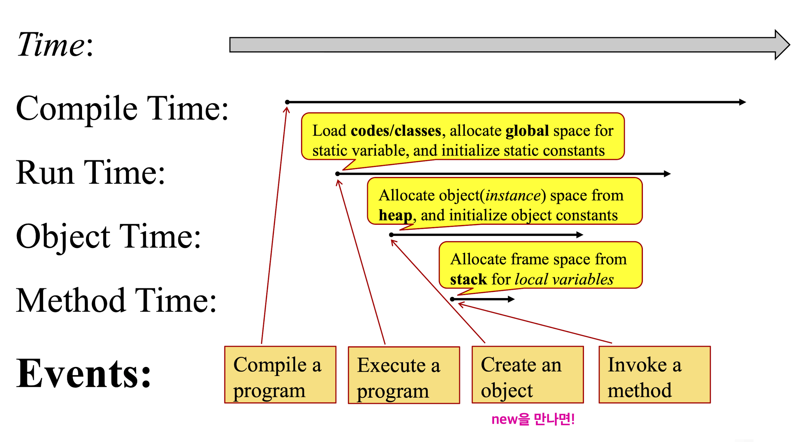

질문: _왜  static method에서는 static variable만 쓸 수 있을까?_

  아래 그림에서 알 수 있듯이 

1. instance가 생성되기 전에 static method이 global space에 할당되기 때문에 
2. 이에 맞춰 할당되는static variable만이 static mehod에 사용이 가능하다. 
3. instance varialbe의 경우 instance 생성되어 heap 영역에 할당되고 나서야, 즉, static method 생성 이후에 생성되기 때문에 사용이 불가능한 것이다.

<small>FIG 1. Java이 Event Timeline</small>